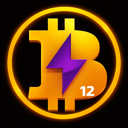

<p align="center">
  
</p>

# BOLT12 Pay on StartOS

> **Upstream:** <https://github.com/Alex71btc/lndk-pay>
>
> Everything not listed in this document should behave the same as upstream
> lndk-pay. If a feature, setting, or behavior is not mentioned here, the
> upstream documentation is accurate and fully applicable.

[BOLT12 Pay](https://github.com/Alex71btc/lndk-pay) is a self-hosted Lightning payment and identity server. It runs an embedded [LNDK](https://github.com/lndk-org/lndk) runtime to create and pay BOLT12 offers through your StartOS LND node, and adds LNURL, Lightning Address (BIP353), and BOLT11 support with a simple web UI.

---

## Table of Contents

- [Image and Container Runtime](#image-and-container-runtime)
- [Volume and Data Layout](#volume-and-data-layout)
- [Network Access and Interfaces](#network-access-and-interfaces)
- [Actions (StartOS UI)](#actions-startos-ui)
- [Dependencies](#dependencies)
- [Backups and Restore](#backups-and-restore)
- [Health Checks](#health-checks)
- [Limitations and Differences](#limitations-and-differences)
- [Contributing](#contributing)
- [Quick Reference for AI Consumers](#quick-reference-for-ai-consumers)

---

## Image and Container Runtime

| Property | Value |
|----------|-------|
| Image | `main` — built from [`Dockerfile`](./Dockerfile) (upstream `app/` via the `upstream/` submodule + LNDK runtime) |
| Base | `python:3.11-slim` + LNDK runtime from `alex71btc/lndk` |
| Architectures | x86_64, aarch64 |
| Entrypoint | `/usr/local/bin/docker_entrypoint.sh` → `start.sh` |

The container runs two processes from [`assets/start.sh`](./assets/start.sh):

- **`uvicorn backend.app:app`** — the BOLT12 Pay web app on `0.0.0.0:8081`.
- **`lndk`** — a background loop that waits for LND to be reachable, then runs LNDK against it (gRPC on `127.0.0.1:7000`, used by the app for BOLT12 offers).

---

## Volume and Data Layout

| Volume | Mount Point | Purpose |
|--------|-------------|---------|
| `main` | `/data` | App config, secrets, and LNDK data dir (`/data/lndk`) |

**Dependency mounts:**

- `/mnt/lnd` — LND volume (read-only) — for the TLS cert (`tls.cert`) and admin macaroon (`data/chain/bitcoin/mainnet/admin.macaroon`).

---

## Network Access and Interfaces

| Interface | Port | Protocol | Purpose |
|-----------|------|----------|---------|
| Web UI | 8081 | HTTP | BOLT12 Pay web interface |

**Access methods (StartOS 0.4.0):**

- LAN IP with unique port
- `<hostname>.local` with unique port
- Tor `.onion` address
- Custom domains / clearnet (if configured)

For Lightning Address / LNURL / `.well-known` endpoints to resolve publicly, expose the Web UI on a public hostname and select it via the **Set Primary URL** action (see below).

---

## Actions (StartOS UI)

### Set Primary URL

| Property | Value |
|----------|-------|
| ID | `set-primary-url` |
| Visibility | Enabled |
| Availability | Any status |
| Purpose | Choose which non-local URL to advertise as the LNURL / Lightning Address base |

Pick one of the service's non-local URLs (use a **clearnet or custom-domain** URL — Tor and `.local` won't resolve for external senders). The selection is stored on the `startos` volume and injected on next start as the app's native `LNURL_BASE_URL`, `LNURL_BASE_DOMAIN`, `PUBLIC_LNURL_ADDRESS`, and `PUBLIC_BIP353_ADDRESS` env vars. These are **defaults** — the in-app admin settings still override them. If a previously-selected URL is later removed, StartOS posts a task to pick a new one.

---

## Dependencies

### LND (`lnd`)

| Property | Value |
|----------|-------|
| **Required** | Yes |
| **Version constraint** | `>=0.20.1-beta:2` |
| **Health checks** | `lnd` must pass |
| **Mounted volumes** | `lnd:main` at `/mnt/lnd` (read-only) — TLS cert and admin macaroon |
| **Reached at** | `lnd.startos` (REST `:8080`, gRPC `:10009`) |
| **Purpose** | Create and pay BOLT12 offers via LNDK |

**LND must have onion-message support enabled.** BOLT12 offers require the following in `lnd.conf`, which is not set by the stock StartOS LND package and must be added manually:

```ini
protocol.custom-message=513
protocol.custom-nodeann=39
protocol.custom-init=39
```

See [instructions.md](./instructions.md) for the exact steps.

---

## Backups and Restore

**Included in backup:**

- `main` volume — app config, secrets, and LNDK data.

LND credentials are not backed up here; they live on the LND package and are re-mounted on restore.

---

## Health Checks

| Check | Display Name | Method | Messages |
|-------|--------------|--------|----------|
| Web UI | "Web UI" | Port 8081 listening | "BOLT12 Pay is ready" / "BOLT12 Pay web interface is not ready" |

---

## Limitations and Differences

1. **Manual LND configuration** — the `protocol.custom-*` options above must be added to `lnd.conf` by hand; BOLT12 offers will not work without them.
2. **LNURL base URL** — seeded from the **Set Primary URL** action; the in-app admin settings can still override it. All other app configuration is done inside the web UI.
3. **Mainnet only** — the LND macaroon path is pinned to `data/chain/bitcoin/mainnet`.

---

## Contributing

See [CONTRIBUTING.md](CONTRIBUTING.md) for build instructions and development workflow.

---

## Quick Reference for AI Consumers

```yaml
package_id: bolt12-pay
image: main (built from Dockerfile; lndk-pay app/ submodule + LNDK runtime)
architectures:
  - x86_64
  - aarch64
volumes:
  main: /data
  startos: (StartOS metadata; not mounted into the container)
dependency_mounts:
  lnd: /mnt/lnd (read-only)
ports:
  ui: 8081
dependencies:
  - lnd (required, >=0.20.1-beta:2, needs protocol.custom-message=513/nodeann=39/init=39)
actions:
  - set-primary-url
```
